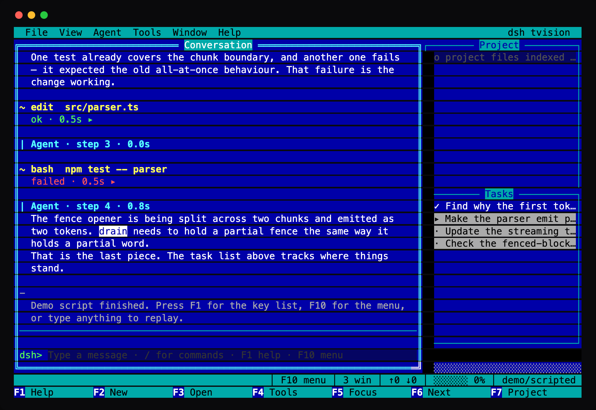
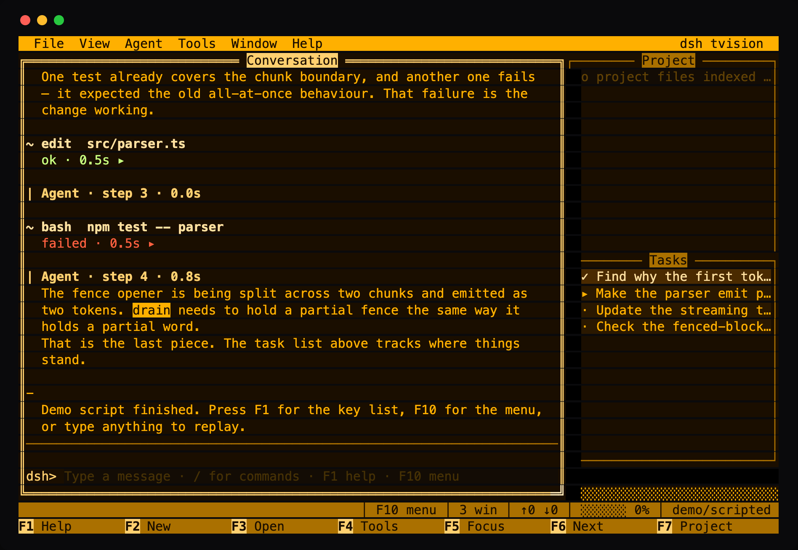
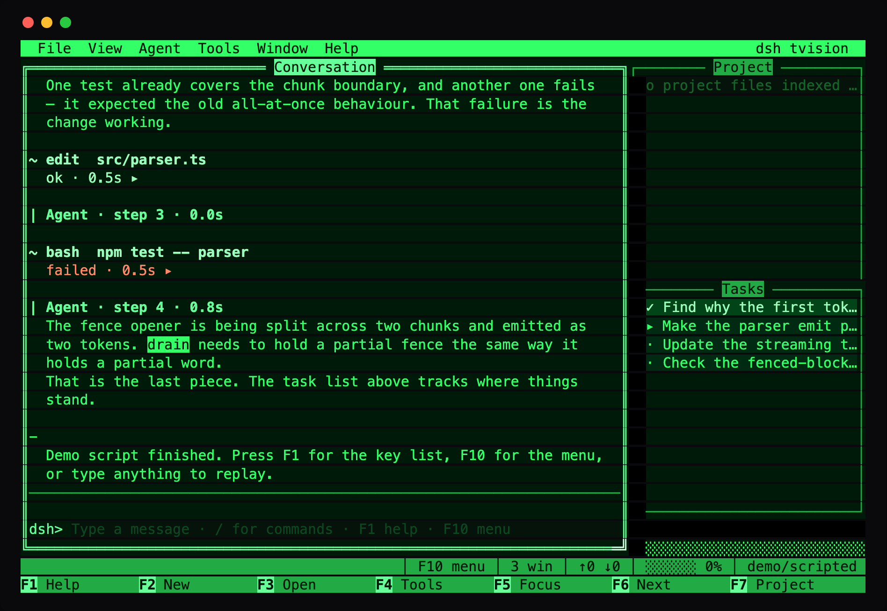
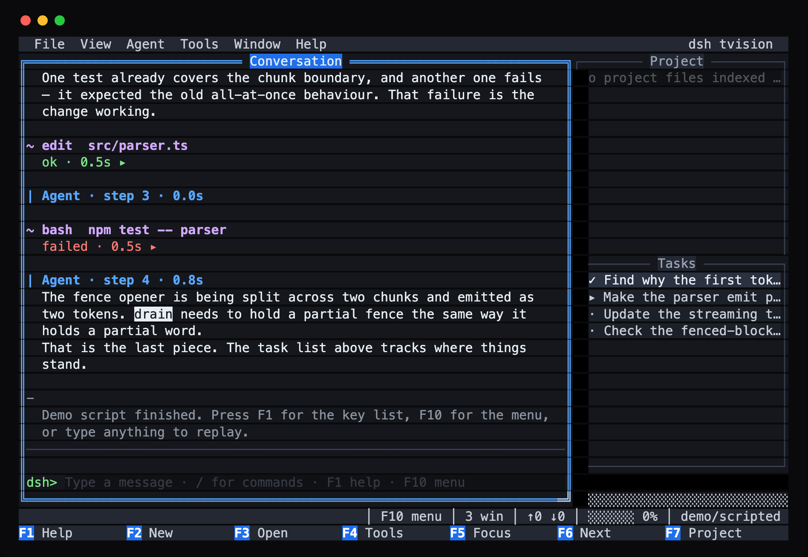

# tvision

[](https://github.com/hongxin/dsh-tvision/actions/workflows/ci.yml)
[](LICENSE)

**给 DeepSeek Harness 智能体的字符型窗口管理器。** 带投影的重叠窗口、Borland 式菜单栏、功能键提示条、鼠标拖拽、五套配色皮肤——以普通的 dsh profile bundle 形式安装，不是 fork。



你的手在 Turbo C 年代记住的那抹蓝——同一个二进制里还带着另外三副面孔：

| 琥珀 CRT | 磷光绿 | 石板灰 |
|:---:|:---:|:---:|
|  |  |  |

```
  File  View  Agent  Tools  Window  Help                        dsh tvision
╔═════════════════════════ Conversation ═════════════════════════╗┌───── Project ──────┐
║> You                                                            ║  o src/parser.ts   │
║  why is the first token so slow?                                ║  o src/stream.ts   │
║                                                                 ║  o README.md       │
║| Agent · 1.4s                                                   ║                    │
║  The parser buffers the whole document before it emits          ║                    │
║  anything, which is why the first token never arrives until     ║                    │
║  the whole file is read.                                        ║                    │
║                                                                 ║                    │
║~ bash  npm test -- parser                                       ║┌────── Tasks ───────┐
║  ok ▸                                                           ║  ✓ Find why it is  │
║                                                                 ║  ▸ Make the parser │
║─────────────────────────────────────────────────────────────────║  · Update the test │
║dsh> refactor it so it streams                                   ║                    │
╚═════════════════════════════════════════════════════════════════╝  ░░░░░░░░░░░░░░░░░░░
             │ F10 menu │ 3 win │ ████░░ 62% │ ↑12.4k ↓3.1k │ deepseek-flash
F1 Help      F2 New       F3 Open      F4 Tools     F5 Focus     F6 Next      F7 Project
```

[English](README.md) | 中文

---

## 不需要智能体就能先看看

不需要 API key、不需要 profile、不需要联网。demo 用一段脚本化的智能体驱动真实的桌面：

```sh
npm install
npm run build
node lib/demo.js                 # Turbo Vision 蓝
node lib/demo.js --skin amber    # P3 琥珀单色
node lib/demo.js --list-skins
```

随便输入点什么按回车就会重放脚本；`F1` 列出按键，`F10` 打开菜单。

---

## 作为 dsh profile 安装

需要 Node `^22.19 || >=24` 与 `dsh` CLI。

```sh
git clone https://github.com/hongxin/dsh-tvision
cd dsh-tvision && npm install && npm run build
dsh plugin --profile tvision add "$(pwd)"
dsh --profile tvision                                    # 在当前目录开启会话
dsh --profile tvision --resume <session-id>              # 恢复历史会话
dsh --profile tvision --skin amber --no-mouse            # 启动选项
```

包发布到 npm 后，克隆构建两步收敛为 `dsh plugin --profile tvision add dsh-tvision`。

在环境变量（或启动目录 / `$DSH_HOME` 下的 `.env`）里设置 `DEEPSEEK_API_KEY`。本地或自建端点无需改代码——把 `DEEPSEEK_BASE_URL` 指过去，或在 `$DSH_HOME/settings.yaml` 里设置 `llm-deepseek.baseURL`。

> **状态。** 已验证：桌面在真实 `dsh --profile tvision` 智能体上挂载并在真实终端绘制（`python3 scripts/pty-profile.py`）；完整链路——流式、reasoning、审批、工具往返——在脚本化模型端点上端到端跑通（`python3 scripts/pty-wire.py`）；独立 demo 通过 18 场景真终端扫描且不变量零缺陷；真实 API 的实弹回合已人工跑过。黄金语料是钉住真实事件形状的手写合成内容——真实转录永不入库。见[设计文档的范围一节](docs/DESIGN.md#6-what-is-not-finished)。

---

## 按键

### 全局

| 按键 | 作用 |
|---|---|
| `F1` | 帮助——完整按键表与鼠标说明 |
| `F2` | 新会话 |
| `F3` | 会话窗口 |
| `F4` | 展开 / 折叠全部工具卡片 |
| `F5` | 聚焦输入行 |
| `F6` | 下一个窗口 |
| `F7` | 项目窗口——选中文件会在输入行插入引用 |
| `F8` | 任务窗口 |
| `F9` | 切换皮肤 |
| `F10` | 菜单栏 |
| `Ctrl+Q` | 退出 |
| `Ctrl+C` | 取消当前回合 |
| `Ctrl+O` | 展开 / 折叠工具卡片 |
| `Ctrl+R` | 显示 / 隐藏思考过程 |
| `Ctrl+Z` | 缩放当前窗口 |
| `Ctrl+F` | 搜索转录——`Enter` 下一个、`Shift+Enter` 上一个、`Esc` 回到原位 |
| `Ctrl+L` | 重绘屏幕 |

### 菜单

`F10` 进入菜单栏，`←`/`→` 在栏上移动，`↓` 拉下列表。`Alt` + 带下划线的字母可直接打开对应菜单；在已打开的列表里按同样的字母会直接执行该项。

### 输入行

| 按键 | 作用 |
|---|---|
| `Enter` | 发送 |
| `Alt+Enter` | 插入换行而不发送 |
| `Tab` | 补全 `/命令` 或 `@文件` |
| `↑` / `↓` | 浏览输入历史 |
| `Ctrl+A` / `Ctrl+E` | 行首 / 行尾 |
| `Ctrl+U` / `Ctrl+K` | 删到行首 / 行尾 |
| `Ctrl+W` | 删除前一个词 |

### 对话区

| 按键 | 作用 |
|---|---|
| `PageUp` / `PageDown` | 翻页 |
| `↑` / `↓` | 滚动一行 |
| `Home` / `End` | 跳到开头 / 结尾 |

向上滚动离开末尾后，新输出不会再把你拽回底部；按 `End` 恢复跟随。

### 会话与任务

| 按键 | 作用 |
|---|---|
| 直接输入 | 过滤会话列表——标题、工作区或 id |
| `Backspace` / `Esc` | 编辑 / 清空过滤词 |
| `k` | 终止选中的后台任务（先确认） |
| `Enter` | 恢复会话 / 查看任务详情 |

### 鼠标

拖标题栏移动窗口 · 拖右下角亮色边角缩放 · 点 `[■]` 关闭 · 点 `[↑]` 或双击标题最大化 · 滚轮滚动指针底下的任何东西，包括功能键提示条。

---

## 皮肤

| `--skin` | |
|---|---|
| `tvision` | Turbo Vision——Borland 蓝：深蓝桌面上的青色窗口框 |
| `phosphor` | P1 绿色 CRT——单一色相，层级全靠亮度 |
| `amber` | P3 琥珀——更暖，长时间看更舒服 |
| `slate` | 现代深色——只要窗口管理器，不要怀旧戏服 |
| `ansi` | 终端自带的十六色，继承而非强加 |

每套皮肤是完整的约 55 个语义角色，而不是换一组颜色：因此在某套皮肤下能看清的控件，在其他皮肤下同样能看清。

安装后的默认皮肤是 `ansi`——继承终端自身配色；`--skin tvision`（或 `F9`）回到 Borland 蓝。独立的 demo 仍以 tvision 蓝作为招牌。

---

## 为什么这样做

一句话：**智能体天然适合字符型 IDE。** 它的活动本来就是文件编辑、shell 命令、diff、任务列表、子代理——这正是当年 Borland 那套界面为之而生的东西，只是少了调试器。

这不是「加了个边框的聊天 TUI」，而是一个窗口管理器：

- **带投影的重叠窗口**：层次在你读一个字之前就已经可见。
- **活动窗口用双线框，非活动用单线框**：隔着房间也能看出键盘要去哪。
- **菜单栏浮于所有窗口之上**：没有任何能力只是「键盘圈的传说」。
- **功能键提示条由键位表生成**：所以它不会说谎。
- **固定单行的输入行**：会自己长高的输入框会把整段对话推上推下。
- **模态对话框就是普通窗口**：审批提示因此白拿同一套键盘、鼠标与焦点逻辑。

对话区左侧有一个字符的装订线——`>` 是你、`|` 是智能体、`·` 是思考、`~` 是工具、`!` 是错误——于是对话的形状先于文字可见。工具调用折叠时占一行，展开后是带框的实体，diff 按增删着色。

完整的设计推理、架构说明与「刻意没做完的部分」，见 [docs/DESIGN.md](docs/DESIGN.md)。

---

## 开发

```sh
npm install
npm run typecheck     # tsc --noEmit
npm test              # 505 个测试
npm run build         # 打包到 lib/
npm run demo          # 跑 demo
```

测试值得单独说一句。`tests/compositor.spec.ts` 把画好的帧重放进**真实的终端模拟器**（xterm.js headless），然后逐单元格比对结果网格——这是唯一能抓住「转义字符串看着对、屏幕上却是错的」那类 bug 的办法。`tests/snapshot.spec.ts` 把整屏帧**以 ASCII 形式**签入仓库，所以 review diff 时能直接看到整个界面：

```sh
Tvision_SNAPSHOT=refresh npx vitest run tests/snapshot.spec.ts
```

### 在真实终端里验证

模拟器能证明转义序列产生的网格与我们以为的一致，但它证明不了真实终端也同意——更够不到任何交互路径。为此有一套 pty 工具：

```sh
# 在真实 pty 下驱动 demo，向它敲键、拖拽。
python3 scripts/pty-drive.py '{"argv":["node","lib/demo.js"],"columns":104,"rows":30,"timeout":8}' > /tmp/capture.bin

# 读回真实终端屏幕上到底是什么。
npm run verify:pty -- /tmp/capture.bin 104 30
```

鼠标拖拽、菜单下拉、帮助窗口与真彩配色，就是这样在真实屏幕上（而非模拟器里）确认的。

`scripts/pty-sweep.py` 会跑一个「尺寸 × 按键序列」的矩阵，检查终端会**静默执行**的那些不变量——没有写到屏幕右边界之外、没有哪一帧把屏幕滚动了、chrome 没有错位：

```sh
python3 scripts/pty-sweep.py --json .tools/sweep.json   # 需要 pty
npx vitest run tests/sweep.spec.ts                      # 检查抓取结果
```

它读取 `.tools/sweep.json`，文件不存在时自动跳过，所以在无法分配 pty 的机器上测试依然是绿的。

### 目录结构

```
src/kit/        cell · text · styles · screen · painter · widget · wm · input · skin
src/session/    保留式文档模型
src/views/      transcript · dialogs
src/widgets/    frame · menubar · statusbar
src/app/        app · composer · questions · events · project · sessions
src/term/       真实终端
```

`kit/` 不 import 它上面的任何东西，也不知道「智能体」是什么；它本身就是一个通用的字符窗口库。

---

## 致谢

MIT。实现是原创的；**集成方式**参考了 `deepseek-harness` 上游移除、后被恢复为 [`@dsh-tui/dsh-tui`](https://github.com/dsh-tui/dsh-tui)（MIT，DeepSeek 与 OpenGuardrails）的开源终端前端——Cordis 插件的组织方式、会话事件折叠的职责划分、审批与提问的 waterfall 接缝、以及测试基建的思路都以其为范本。也正是因为读了它，才发现它自带的两处 API 漂移。

界面的形态则要归功于 Turbo Vision（Borland）、Midnight Commander 与 [moc](https://github.com/jonsafari/mocp)。
